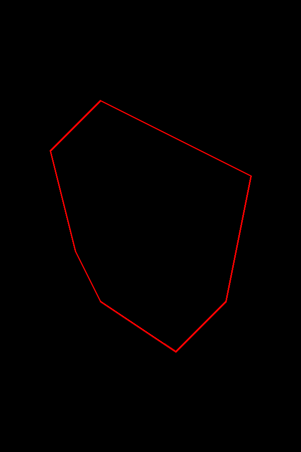
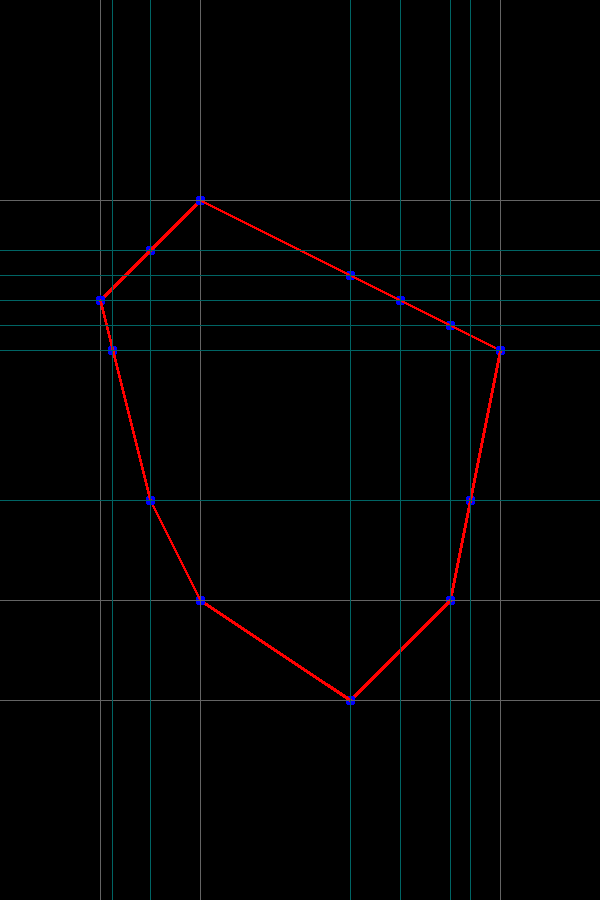
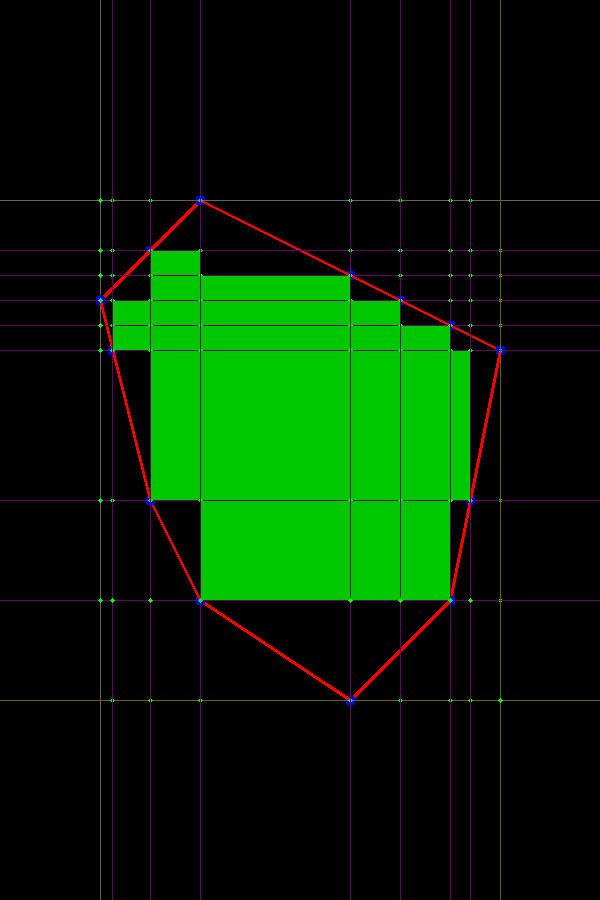
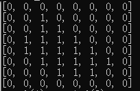

## rectinpolygon
get largest inscribed rectangle in a polygon

 [DEMO Viedeo](img/v.mp4)
<video width="320" height="240" controls>
  <source src="img/v.mp4" type="video/mp4">
  Your browser does not support the video tag.
</video>

## Acknowledgements

The used Algorithm was described 2019 in [Algorithm for finding the largest inscribed rectangle in polygon](https://journals.ut.ac.ir/article_71280_2a21de484e568a9e396458a5930ca06a.pdf) by [Zahraa Marzeh, Maryam Tahmasbi and Narges Mireh](https://journals.ut.ac.ir/article_71280.html).
